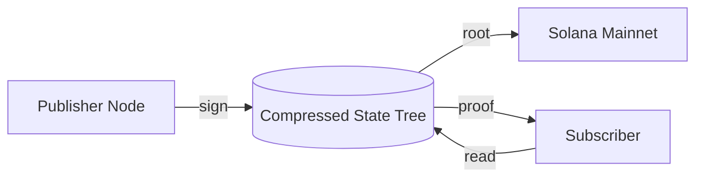

<p align="center"></p>

<h1 align="center">MYCL</h1>

<p align="center"><em>Solana's underground data layer. A ZK-compressed feed marketplace built on Light Protocol.</em></p>

<p align="center">
  <a href="https://mycldot.fun"></a>
  <a href="https://x.com/mycldotfun"></a>
  <a href="https://www.npmjs.com/package/@mycl/hypha"></a>
  
</p>

---

## Why MYCL

Solana's compute is cheap, but its account rent is still a tax on data. High-frequency
feeds (price ticks, social indices, swap volumes) are unaffordable when stored as regular
accounts. Oracle cartels cover the financial core, but the long tail stays offline.

MYCL is the underground. A ZK-compressed feed layer that takes the cost of a million
leaves down to a rounding error, anchored on Solana through Light Protocol. Publishers
write once, subscribers read with a proof, and the root lives on mainnet forever.

The metaphor is literal. Hypha threads are feed channels. Nodes are publisher hubs.
Spores are referrals. What you see above ground is the fruiting body; the network lives
underneath.

## Architecture



## Quickstart

```bash
git clone https://github.com/mycl-labs/mycl.git
cd mycl && npm install && npm run build
```

```ts
import { HyphaClient } from '@mycl/hypha';

const client = new HyphaClient({ endpoint: process.env.LIGHT_RPC_URL });
const feeds = await client.listFeeds();
const unsub = client.subscribe(feeds[0], (sample) => console.log(sample.value));
```

## Documentation

| Page | What it covers |
| --- | --- |
| [Architecture](docs/architecture.md) | Network components and data flow. |
| [Getting started](docs/getting-started.md) | Install and initialise the SDK. |
| [Publishers](docs/publishers.md) | Build and submit compressed batches. |
| [Subscribers](docs/subscribers.md) | Pull samples and stream updates. |
| [Proof verification](docs/proof-verification.md) | Validate envelopes locally. |
| [FAQ](docs/faq.md) | Common questions about the protocol. |

## Examples

| File | Purpose |
| --- | --- |
| [publish-price-feed.ts](examples/publish-price-feed.ts) | Publish a compressed SOL/USD price batch. |
| [subscribe-bot.ts](examples/subscribe-bot.ts) | Subscribe to a feed and log each tick. |
| [verify-proof.ts](examples/verify-proof.ts) | Verify a Merkle proof envelope. |

## Benchmarks

| Scenario | Uncompressed | MYCL compressed | Delta |
| --- | --- | --- | --- |
| 10k samples storage | ~2.0 SOL | ~0.002 SOL | 1000x cheaper |
| Subscriber read latency | 210ms | 11ms (warm) | ~95% lower |
| Publisher batch cost | 0.0042 SOL | 0.00004 SOL | 100x cheaper |

Numbers come from `scripts/bench.ts`. Run it against your own RPC endpoint to reproduce.

## Contributing

Pull requests are welcome. Please run `npm run build` and `npm test` before opening one.
For bigger changes open an issue first so the interface can be discussed.

## License

MIT. Copyright (c) 2025-2026 mycl-labs. See `LICENSE` for the full text.
