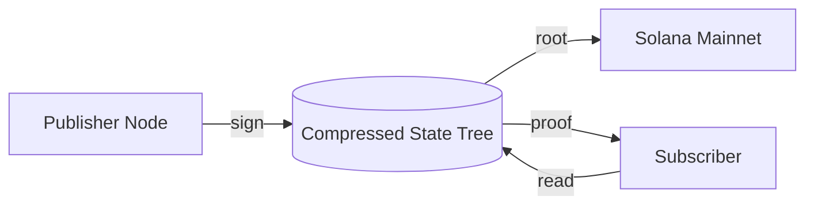

# Architecture

MYCL lives beneath Solana. Feeds are written into compressed state trees
maintained on the Light Protocol, anchored on Solana mainnet, and read by
subscribers with Merkle proofs for integrity.

## Components

- **Publisher**: signs feed batches, pushes leaves into the compressed tree.
- **Compressed State Tree**: Light Protocol account holding the current root.
- **Subscriber**: reads samples plus proof paths, verifies locally.
- **Indexer**: optional service caching feed metadata and recent samples.

## Throughput budget

A single compressed tree of depth 20 holds up to 1_048_576 leaves. At the
default slot cadence of 400ms that covers roughly a full day of 1-second
samples for several hundred feeds before rotation is required.
